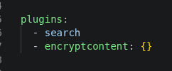
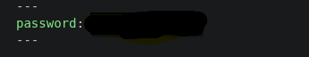

# Documentation

## Switch

Sur le switch de niveau 3 nous l'avons configurer en ssh avec et un mot de passe 

 * apres quoi nous avons eu un problème de mémoire une fois le switch débrancher les configuration sont supprimer ou sauté 

 * le problème a été résolu en (FLO)


Nous avons ajouter deux Vlan au début le Vlan MANA qui va manager le switch routeur et VLAN et un Vlan 212 qui est pour l'instant un vlan de test ...(FLO)


nous ajoutons le mode trunk sur le switch 

## Routeur
(à venir)
- reinitialisation du routeur 
- mode trunk
- config realisé

## Page protégée par mot de passe

Une page secrète a été mise en place pour isolé les configuration qui serait sensible. Cette protection est possible grace au plugin `mkdocs-encryptcontent-plugin`, installé via pip et déclaré dans le fichier `mkdocs.yml` :

​```yaml
plugins:
  - search
  - encryptcontent: {}
​```

Le mot de passe est défini directement dans l'en-tête (il faut créer un fichier en .md ) de la page à protéger :



## dans la nouvelle page

​

Lorsqu'un visiteur accède à cette page, le contenu n'est pas affiché directement : un formulaire lui demande de saisir le mot de passe avant de pouvoir le consulter.

Cette protection agit uniquement sur le site généré (HTML) : elle empêche un visiteur classique de voir le contenu sans le mot de passe, mais ne protège pas le code source du dépôt Git, où le mot de passe reste visible en clair pour toute personne ayant accès au dépôt.