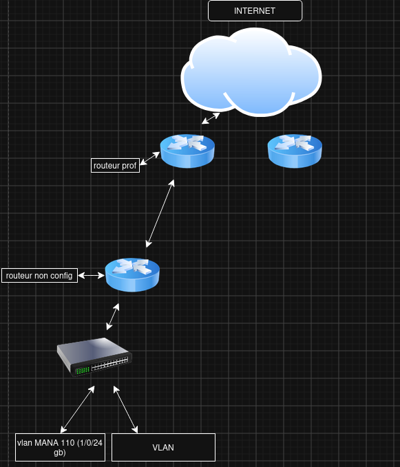

# Infrastructure

## IPAM
notre tableau IPAM actuel
image a mettre

### Plan d'adressage VLAN

| VLAN | Nom            | Réseau            |
| ---- | -------------- | ----------------- |
| 110  | Management     | `10.110.0.0/16`   |
| 210  | *DMZ*          | `172.28.210.0/24` |
| 211  | Serveur        | `172.28.211.0/24` |
| 212  | Clients        | `172.28.212.0/24` |

### Configuration réalisée (vlan)

Les VLAN ci-dessus ont été configurés sur le switch, conformément au plan d'adressage IPAM.

Cette étape a été réalisée après l'activation de l'accès SSH sur les équipements, permettant leur administration à distance.

Nos pages de documentation ont également été configurées et liées aux dépôts GitHub de chacun.

## Routage
*
*
*
*

## Équipements réseau
*
*
*
*
### Switch

*
*
*
*
Le switch permet de connecter les différents équipements et de gérer les VLAN.

### Réseau

Le réseau attribué au site de Bourges est :

`172.28.192.0/19` jusqu'a `172.28.223.255/19`

### Infra

Le site comprend notamment :

* un switch administrable en ssh 
* Un routeur
* des postes clients/test

---
